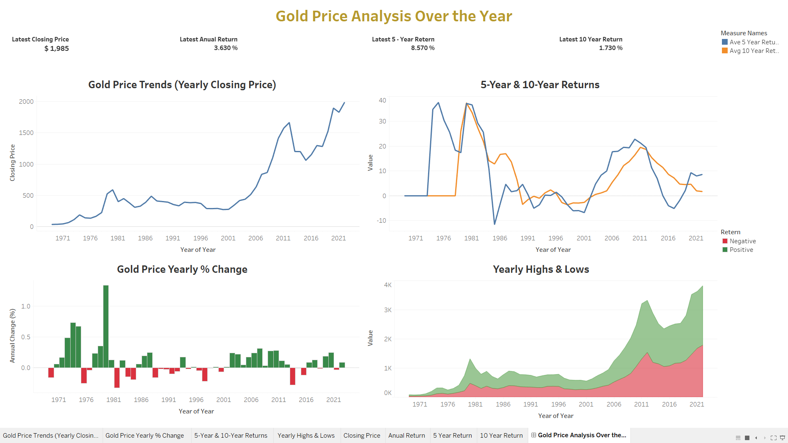

# Gold Price Analysis Dashboard

## Overview

This dashboard is built on Tableau and gives an overview of gold price history across 50 years from 1971-2021. This infographic visualizes notable trends, yearly returns, and annual volatility in gold prices to provide a glimpse of its investment performance over the last five decades. The dashboard aims to offer its stakeholders a short and informative look into the dynamics of gold prices.

---

## Key Visualizations

The dashboard consists of four sections, presenting different aspects of gold price information:

*   **Gold Price Trends (Yearly Closing Price):** A line chart illustrating the yearly closing price of gold, showing overall price trends over time.
*   **Gold Price Yearly % Change:** A bar chart expresing the annual percentage change in gold prices, highlights periods of significant growth and decline.
*   **5-Year & 10-Year Returns:** A line chart comparing the average 5-year and 10-year returns, demonstrating longer-term investment performance.
*   **Yearly Highs & Lows:** An area chart highlighting the yearly high and low prices of gold, illustrating annual price volatility.

The dashboard also prominently displays the following key metrics:

*   Latest Closing Price
*   Latest Annual Return
*   Latest 5-Year Return
*   Latest 10-Year Return

---

## How to Use

1.  **Download the Tableau Workbook:** The Tableau workbook file (`Gold-Price-Analysis.twb` or `.twbx`) can be found from this repository.
2.  **Open in Tableau:** Use [Tableau Desktop](https://www.tableau.com/products/desktop) program to open the document file. 
3.  **Interact with the Dashboard:** The dashboard interface can be explored by switching between different visualizations located at the dashboard's bottom section. When mouse pointers hover over data points in the charts they will display specific details.

---

## Dashboard Preview

Note: Viewing the complete interactive element requires opening the workbook through Tableau Desktop.

---

## Data Source

The data used in this dashboard was obtained from Yahoo Finance. The dataset includes historical gold prices from 1971 to 2021.

*The `data/` directory contains the raw data file.*

---

## Key Insights

*   **Long-Term Growth:** The line chart of yearly closing prices demonstrates the overall upward trend of gold prices over the past five decades.
*   **Volatility:** The annual percentage change chart demonstrates which years have the highest price fluctuations that present both elevated risks together with possible lucrative outcomes.
*   **Investment Performance:** A comprehensive view regarding gold as an investment emerges through analyzing the returns accumulated during both the 5-year and 10-year periods.
*   **Annual Price Range:** Users can find short-term trading opportunities through the yearly highs and lows chart which displays the annual price range.
*   **Latest Metrics:** The dashboard provides real-time indicators of closing price, annual return, five-year return, and ten-year return

---

## Repository Structure

*   **`data/`:** Contains the raw financial data used in the dashboard.
*   **`docs/`:** Folder for additional documentation or reports related to the project.
*   **`images/`:** Stores screenshots of the dashboard for quick previews.
*   **`Gold-Price-Analysis.twb`:** The main Tableau workbook file.
*   **`README.md`:** Contains project information and operational guidelines.
*   **`LICENSE.md`:** License details for the project.

---

## Requirements

*   **Tableau Desktop:** Version 2021.1 or later.
*   **Data Files:** Ensure the file in `data/` is linked correctly in Tableau.

---

## License

This project is licensed under the [MIT License](LICENSE.md). This work is available for modification and uses alongside the requirement to provide proper acknowledgement.

